### 一、常用知识点
#### 1.1 如何使用命令行把文件夹用VS或者webstorm打开
+ vs安装的时候已经默认添加到环境变量了，直接在文件夹下输入：code .就会自动把该文件夹用visual Studio编辑器打开
+ webstorm的话，添加到环境变量就OK，如我的ws，我把：E:\tools\WS\WebStorm 2016.3.4\bin；添加到环境变量，然后在文件夹下输入：webstorm .就会自动把所在文件夹用ws打开了
+ 命令行:ping url 查看该url的IP地址
+  1 案例- [豆瓣热映电影](http://wjf444128852.github.io/sumDemos/doubanmovie/)(源码在webpack/demos/webpack-one)

#### 1.2 开发依赖与项目依赖(package.json)
+ 开发依赖就是开发过程中用到的如编译工具等，应该放在devDependencies下面
+ 项目依赖就是实际项目中用到一些插件，库文件等，如jQuery，应该放在dependencies下,意思上线后用到的
+ 开发依赖：npm install --save-dev xxxx简写：npm install -D xxxx
+ 项目依赖：npm install --save xxxx简写：npm i -S xxx
+ npm uninstall jquery -D 把开发依赖下的jquery解除

#### 1.3 命令行操作创建文件夹和文件
+ mkdir folderName创建文件夹
+ touch index.js 创建 index.js
+ mv index.js entry.js src/  把index.js entry.js移动到src目录下
+ rm build.js 删除build.js
+ rm -rf build 删除文件夹

### 二、配置思想以及流程
+ 1 模块化开发commonjs
+ 2 启动server webpack-dev-server
+ 3 版本号控制 hash  chunkhash
+ 4 html自定义模板
+ 5 css，sass引入
+ 6 抽离css
+ 7 压缩合并JS
+ 8 用babel编译es6,需要创建.babelrc文件
+ 9 mock数据(npm i json-server -g 搭建虚拟服务器)
+ 10 external外部配置文件(开发依赖)，例如项目用到jQuery

### 1、commonJS模块化的四个步骤
+ 1 创建模块，var ...
+ 2 module.exports=模块名字，暴露模块
+ 3 var name=require('模块名字');
+ 4 使用模块：如下
+ 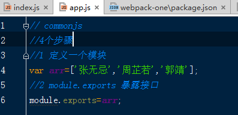
+ 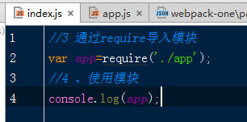
+ **切记：不要循环引用(如a依赖b,b依赖c,c依赖d...)**

### 2 如何启动服务器以及手机查看效果
+ npm install webpack-dev-server -g 全局安装webpack服务器，webpack-dev-server启动服务器，如果报错(Error: `output.path` needs to be an absolute path or `/`.
)，说明输出路径必须是绝对路径
+ devserver有自动刷新功能
+ 如何手机实时查看，如下：配置host,我的本机IP，port端口，手机和电脑同一个局域网即可访问：http://172.16.9.142:6800/ 查看实时效果
+ 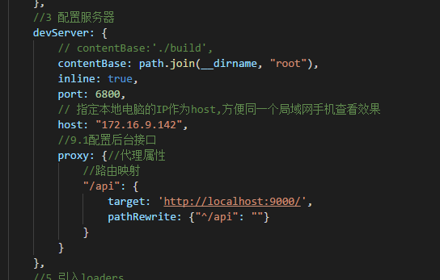
+ webpack-dev-server --hot --inline
+ 题外话，启动服务器后浏览器查看DOM会看到html标签下有shadow-root，具体了解请[参考图灵社区](http://www.ituring.com.cn/article/177453 "组件化")

### 3 如何给文件配置版本号，清除缓存
+ filename:'[name]_[chunkhash].js'
+ 只要源代码不变，版本号不会变得。
+ 可以清除缓存，出现BUG可以回滚原来版本

#### 4 HTML模板配置
+ 可以是xxx.html也可以是其他如xxx.ejs
+ 使用ejs可以在自定义输出
+ <%= htmlWebpackPlugin.options.somename %>
+ 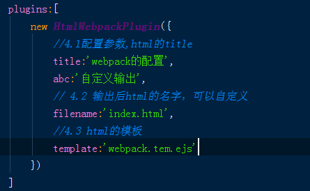
+ template.ejs 内如下：
+ 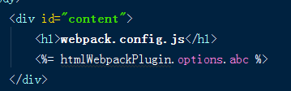
+ 自动生成后html内部如：
+ 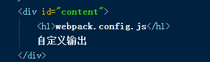

#### 5 css，sass的引入
+ 需要分别npm i css-loader style-loader -D
+ css-loader负责把css编译为JS
+ style-loader负责把css嵌入到html内

#### 6 css抽离
+ 能不能把CSS抽离，单独放在一个文件，需要配置：extract-text-webpack-plugin插件(6-6.2)

#### 7 压缩合并以及代码
+ 直接调用webpack.optimize.UglifyJsPlugin()内置插件就可以了
+ 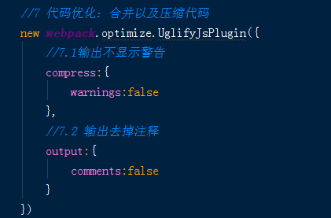
+ 这样就会同时合并到一个JS文件内了(建议开发的时候不要压缩合并)

#### 8 编译es6，需要分辨安装如下依赖
+ npm install babel-core --save-dev
+ npm install babel-loader --save-dev
+ npm install babel-preset-es2015 --save-dev

#### 9 mock数据，需要json-server搭建虚拟服务器
+ npm install json-server -g
+ 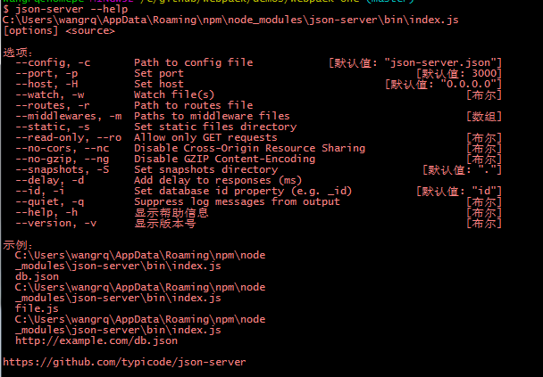
+ mock文件夹下是接口数据文件和mock.js(作为mock数据的配置)
+ .json是字符串，里面key和value必须有双引号
+ 现在可以用json-server搭建一个虚拟服务器，(mock模拟)如命令行运行：json-server mock/mock.js 如下
+ 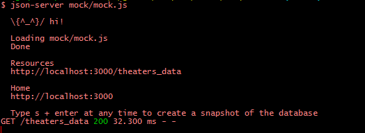
+ json-server的参数配置如：
+ 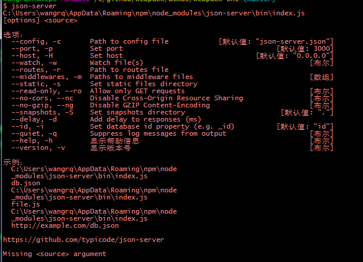
+ json-server mock/mock.js -p 9000
+ 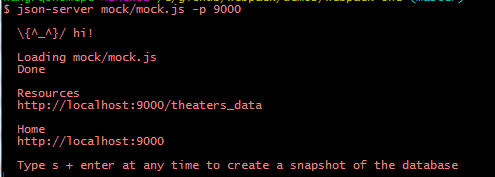
+ 默认监听的是mock.js

##### 9.1 如何用fetch去发送Ajax请求
+ [fetch简介](https://segmentfault.com/a/1190000003810652)
+ 如：student.js/9.0

#### 9.2 postman测试接口获取数据的chrome扩展程序，chrome的扩展程序Hostadmin可以把IP地址映射到自定义的域名
+ 翻墙之后在chrome扩展应用商店搜索postman并安装该扩展程序，会自动安装一个本地的postman程序，注册登录打开后可以测试后台的接口文档。如查看豆瓣：即将上映的电影api接口如下：
+ 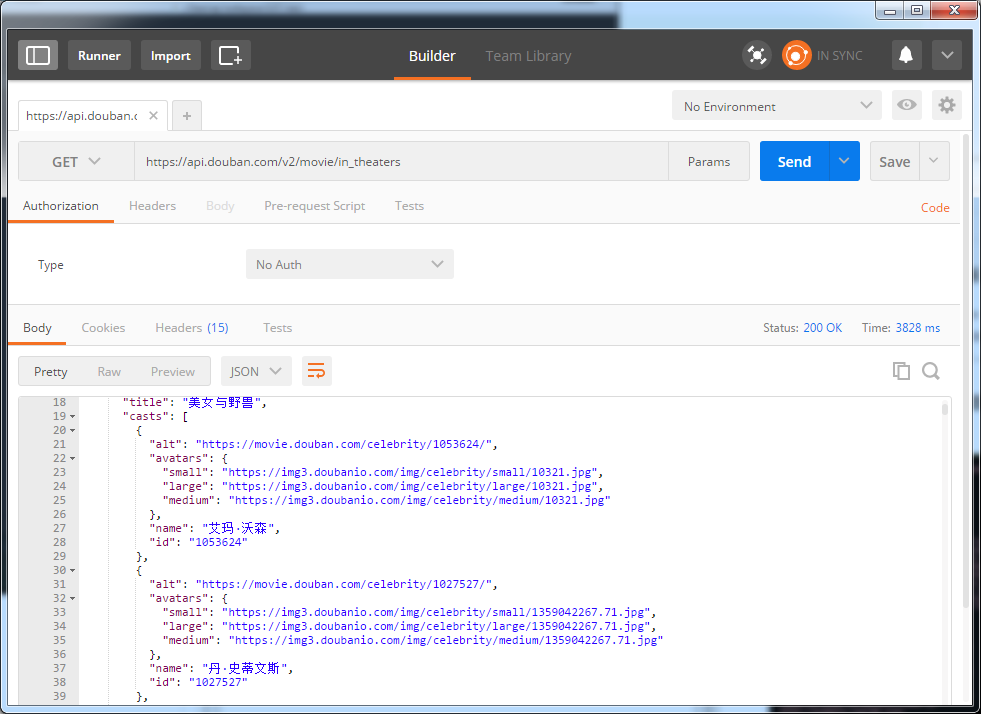
+ 可以搜索：豆瓣开发者(公开的接口文档)
+ 当然也可以直接浏览器输入接口地址，借助chrome的JSONView扩展程序去盘版接口文档，不然默认的很难看清楚

#### 10 处理项目依赖的外部文件，如jQuery
+ externals的配置项，此时得在html模板内提前引入jQ,(查看需解除9.3和9.31的注释，9.2冲突！)